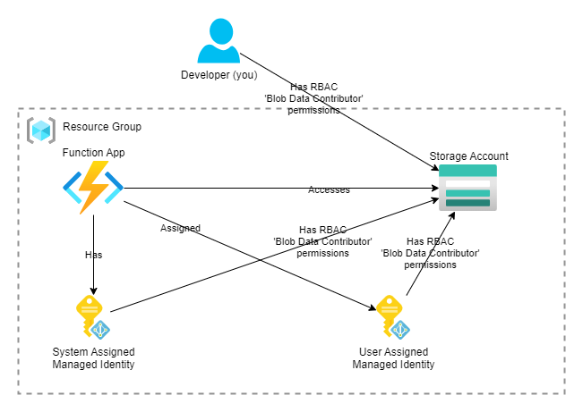

# Azure ManagedIdentity demo using a Azure Functions

Let yourself be amazed by the shear wonders of __Managed Identities__ in Azure.

This is a simple demo to show how to use Azure ManagedIdentity in an Azure Function to access an Azure Storage Account.

It will show the use of:

- [DefaultAzureCredential](https://learn.microsoft.com/en-us/dotnet/api/azure.identity.defaultazurecredential?view=azure-dotnet)
- [ManagedIdentityCredential](https://learn.microsoft.com/en-us/dotnet/api/azure.identity.managedidentitycredential?view=azure-dotnet) (for system-assigned and user-assigned MI)
- [ChainedTokenCredential](https://learn.microsoft.com/en-us/dotnet/api/azure.identity.chainedtokencredential?view=azure-dotnet)
- [AzureCliCredential](https://learn.microsoft.com/en-us/dotnet/api/azure.identity.azureclicredential?view=azure-dotnet)

## Solution design



This solutuin will setup a **Function App** running a few demo's about Managed Identity,
and a **Storage Account** to whitch the Function App conntect to fetch the list of containers,
just to demonstrate the usage of Managed Identities.  
The Functtion App will have a fixed **System Assigned Managed Identity**
and attached a **User Assigned Managed Identity**.
Next, all Managed Identities, as also the developer (you),
will be assigned **Storage Blob Data Contributor** role on the storage account in order to access the Storage Account's data.

## Prerequisites

- Access to an Azure Subscription
- Azure CLI installed (Solution is developed/tested with v2.59)
- Azure Functions Core Tools installed (for runing local in VS-Code)
- Azurite storage emulator installed (for runing local in VS-Code)

## Setup

1. Update the input variables in [Setup.ps1](Setup.ps1) to your needs
2. Run [Setup.ps1](Setup.ps1). This will create the full solution. You can also run each block manually.

## Usage

1. Run/develop locally using the 'Azure Functions Core Tools' and 'Azurite storage emulator'.
2. Or test the Functions in the Azure Portal (after deploying using [Setup.ps1](Setup.ps1))

## Result

Below is a table of all the results of local development (in Function emulator)
and Function App (Test/Run of the Function in the Function App).

| Credentials | Local development | Function App |
| ----------- | ----------------- | ------------ |
| <sub>DefaultAzureCredential</sub> | <sub>Token details:<br>- app_displayname = **Microsoft Azure CLI**<br>- appid = &lt;guid&gt;<br>- name = **Marco Vervoort**<br>- oid = &lt;guid&gt;<br>- unique_name = &lt;e-mail address&gt;</sub> | <sub>Token details:<br>- app_displayname = **mvrs-mi-demo2-func**<br>- appid = &lt;guid&gt;<br>- oid = &lt;guid&gt;</sub> |
| <sub>System Assigned<br>ManagedIdentityCredential</sub> | <sub>Token details failed:<br>ManagedIdentityCredential authentication unavailable.<br>Multiple attempts failed to obtain a token <br>from the managed identity endpoint.</sub> | <sub>Token details:<br>- app_displayname = **mvrs-mi-demo2-func**<br>- appid = &lt;guid&gt;<br>- oid = &lt;guid&gt;</sub> |
| <sub>User Assigned<br>ManagedIdentityCredential</sub> | <sub>Token details failed:<br>ManagedIdentityCredential authentication unavailable.<br>Multiple attempts failed to obtain a token <br>from the managed identity endpoint.</sub> | <sub>Token details:<br>- app_displayname = **mvrs-mi-demo2-umi**<br>- appid = &lt;guid&gt;<br>- oid = &lt;guid&gt;</sub> |
| <sub>ChainedTokenCredential<br>(ManagedIdentityCredential + <br>AzureCliCredential)</sub> | <sub>Token details:<br>- app_displayname = **Microsoft Azure CLI**<br>- appid = &lt;guid&gt;<br>- name = **Marco Vervoort**<br>- oid = &lt;guid&gt;<br>- unique_name = &lt;e-mail address&gt;</sub> | <sub>Token details:<br>- app_displayname = **mvrs-mi-demo2-func**<br>- appid = &lt;guid&gt;<br>- oid = &lt;guid&gt;</sub> |

And all of the succesful calls will also show the fetched containers, like:
```
Fetched containers:
- azure-webjobs-hosts
- azure-webjobs-secrets
- container1
- container2
- container3
- container4
```

## Links

- [Use managed identities on a virtual machine to acquire access token - Managed identities for Azure resources | Microsoft Learn](https://learn.microsoft.com/en-us/entra/identity/managed-identities-azure-resources/how-to-use-vm-token)